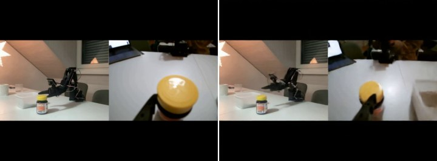
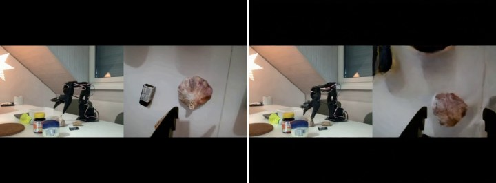
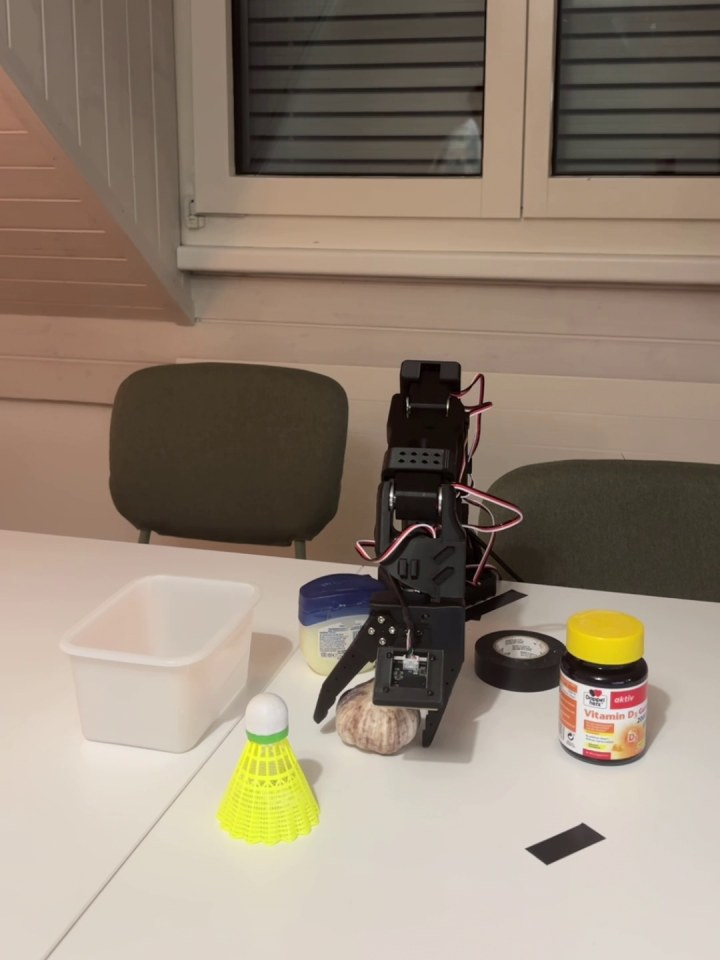
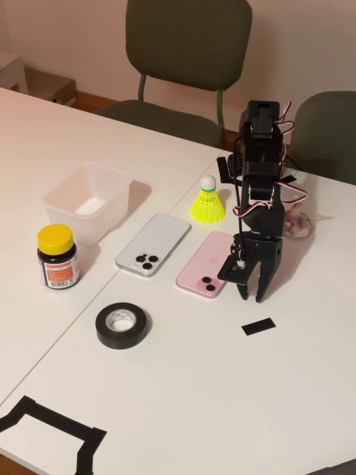
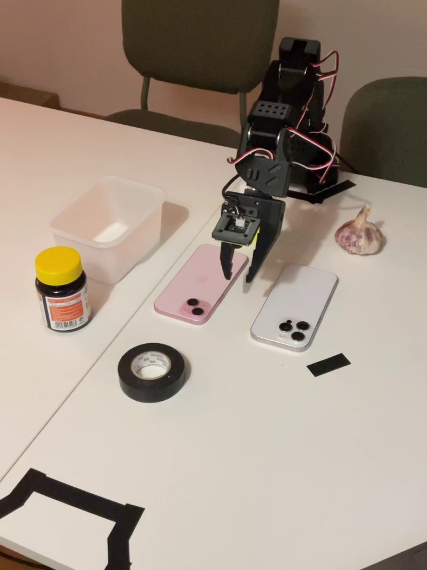

# MimicVideo on SO-101

This repository contains the MimicVideo implementation used for the SO-101
real-world heterogeneous-data experiment in our 3DV final project.

The upstream MimicVideo README is preserved in
[README_ORIGINAL.md](README_ORIGINAL.md). This page focuses on what we changed,
what checkpoints/artifacts are used, and how to run the SO-101 workflow on the
Euler cluster.

## Project Scope

We adapt MimicVideo to the SO-101 robot setting with two camera views and
joint-space control. The code in this branch is centered on the real-world
heterogeneous-data experiment:

- Robot: SO-101 follower arm
- Observations: front camera + wrist camera, horizontally stacked at 5 FPS
- Raw demonstrations: leader-arm teleoperation at 30 FPS
- Video model: MimicVideo/Cosmos Predict2 video backbone with SO-101 Video LoRA
- Action model: world-to-action decoder trained for SO-101 joint actions
- Main action variant: 30 Hz joint deltas for joints 0..4 with absolute gripper

We also trained/evaluated the homogeneous bottle-to-container setting, but the
heterogeneous dataset produced the stronger MimicVideo results. This README
therefore treats the heterogeneous workflow and checkpoints as the primary path,
while keeping the homogeneous clips as context for video-prediction failure
analysis.

The original MimicVideo Bridge checkpoint predicts end-effector trajectories. For
the SO-101 setup, we use a joint-space action decoder so rollouts use the same
joint-control interface as the teleoperated demonstrations, without adding a
MimicVideo-specific inverse-kinematics layer.

## What This Branch Adds

- SO-101 two-camera preprocessing wrappers for video/action data.
- Euler setup, asset download, preprocessing, training, and eval wrappers under
  `scripts/so101/`.
- SO-101 action decoder config for the released `delta30_gripper_absolute`
  variant, built on the existing SO-101 delta30 action setup.
- Published artifact envs for loading SO-101 Video LoRA and action decoder
  checkpoints from Hugging Face.
- A safer external-video reader for heterogeneous SO-101 action training.
- Normalizer-stat export support for dataset-free SO-101 policy serving.

For the full command runbook, see [SO101_WORKFLOW.md](SO101_WORKFLOW.md).

## SO-101 Data Setting

The real-world SO-101 experiment uses two data regimes:

| Dataset | Episodes | Frames | Duration | Description |
| --- | ---: | ---: | ---: | --- |
| Homogeneous | 110 | 43,095 | 23.94 min | Bottle-to-container pick-and-place |
| Heterogeneous | 153 | 54,647 | 30.36 min | 51 active task descriptions across pick-and-place, stacking, and pushing |

This repository is set up primarily for the heterogeneous MimicVideo workflow.
The homogeneous bottle setting was also trained/evaluated, but is not the main
release path here. [SO101_WORKFLOW.md](SO101_WORKFLOW.md) documents how to change
the env files to run the same pipeline on the bottle dataset.

## Qualitative Results

The thumbnails below link to the corresponding MP4 clips in `assets/so101/`.

### Video Prediction Results

These clips show the future-video prediction quality that the action decoder
conditions on. The homogeneous example illustrates the video-prediction failure
mode, while the heterogeneous example is representative of the main release
setting.

| Homogeneous: GT vs Prediction | Heterogeneous: GT vs Prediction |
| --- | --- |
| [](assets/so101/prediction_homogeneous_gt_vs_pred.mp4) | [](assets/so101/prediction_heterogeneous_gt_vs_pred.mp4) |

### Real-World Rollouts

These clips show SO-101 policy execution in the real workspace.

| Pick-and-Place | Push, initial object on right | Push, initial object on left |
| --- | --- | --- |
| [](assets/so101/rollout_mimicvideo_pick_place.mp4) | [](assets/so101/rollout_mimicvideo_push_right_initial_right.mp4) | [](assets/so101/rollout_mimicvideo_push_right_initial_left.mp4) |

## Checkpoints and Artifacts

Published artifacts used by the SO-101 workflow:

| Artifact | Hugging Face repo |
| --- | --- |
| Multi-object SO-101 Video LoRA | `dreamdifferent/mimic-video-so101-multi-object-2cam-hstack-5fps-v2w-lora` |
| Multi-object delta30 gripper-absolute action decoder | `dreamdifferent/mimic-video-so101-multi-object-delta30-gripper-absolute-action-decoder` |

The repo paths and filenames are encoded in:

```text
scripts/so101/artifacts/so101-multi-object-delta30-gripper-absolute.env
```

## Quick Start on Euler

Set up the shared environment once:

```bash
cd /cluster/project/cvg/students/$USER/workspace/mimic-video

bash scripts/so101/setup_env.sh
export PATH="$SCRATCH/mimic_video/shared/uv-bin:$PATH"
hf auth login
```

Download and check published assets:

```bash
bash scripts/so101/download_base_backbone.sh

bash scripts/so101/download_assets.sh \
  scripts/so101/experiments/so101-multi-object-delta30-gripper-absolute.env

bash scripts/so101/check_assets.sh \
  scripts/so101/experiments/so101-multi-object-delta30-gripper-absolute.env
```

Submit the 40 GB GPU action-decoder job:

```bash
bash scripts/so101/train_action_decoder.sh \
  scripts/so101/experiments/so101-multi-object-delta30-gripper-absolute.env \
  --partition=gpupr.24h \
  --gres=gpumem:40G \
  --time=24:00:00
```

For full preprocessing, 80 GB runs, dataset switching, checkpoint resume, and
policy-server commands, use [SO101_WORKFLOW.md](SO101_WORKFLOW.md).

## Repository Map

```text
scripts/so101/                              SO-101 setup/run wrappers
scripts/so101/experiments/                 dataset and training env files
scripts/so101/artifacts/                   published checkpoint/artifact env files
model/cosmos_predict2/configs/dataloading/ SO-101 data and policy IO configs
model/cosmos_predict2/data/action/         action transforms and zarr readers
eval/so101/                                SO-101 policy serving and stats export
SO101_WORKFLOW.md                          detailed Euler runbook
README_ORIGINAL.md                         upstream MimicVideo README
```

## Notes

- The main released SO-101 action variant is
  `ACTION_TRANSFORM=delta_gripper_absolute`: joints 0..4 are incremental deltas,
  while the gripper remains absolute.
- The current SO-101 MimicVideo implementation is joint-space. End-effector-space
  SO-101 support would require wiring LeRobot kinematics/FK/IK into the data and
  eval pipeline.
- This branch contains the MimicVideo side of the 3DV project. Other policy
  baselines live outside this repository.
